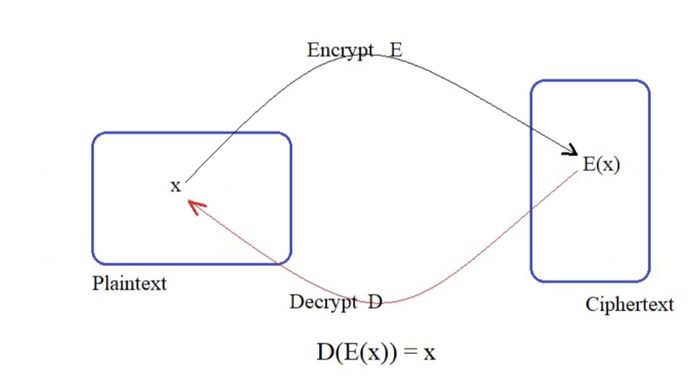

# cryptography
math and programming in Cryptography 

Cryptography is one of fascinating subject in computer science. We could always find a hidden message underneath the 
data we receive. The data could be a picture, alpha numeric characters, symbols, morse code, sounds, or any form of 
communication medium. We use a series of well defined steps called cipher which is an algorithm to encrypt and decrypt.
 

Do you know the first cipher machine was developed in 1920's. Well we might heard of enigma used by allies to broadcast 
encrypted messages. For a single encoded message there were assumed total of approx 160 million million chances and only 
one of them is correct. Later Alan Turing a great mathematician comes up with intelligent way of cracking the message 
during WorldWarII and saved millions of lives.  

As a software engineer we might have come across various industry standard encryption algorithms used to protect our data.
Such as DES, RSA, Blowfish, AES, Twofish, SHA1, IDEA, MD5....  

This repo presents some of the ways and the math behind well known encryption standards.  
Pre-requisites: Number Theory algorithms, Algebra, Probability, basic calculus.  
Programming: Python is used for designing the algorithms, encoding and decoding messages.  

Generally, we assume that the message that we wish to send has been converted to
an integer in the set Jm = {0, 1, 2, 3, . . . , m − 1}, where m is some integer (positive)
to be determined.  

For Encipher   
        E : Jm −→ Jm   
            x −→ E(x)   

For Decipher  
        D : Jm −→ Jm   
      such that  D (E(x)) = x  
   
       
    
The Basic ways of Encryption:  
1. Encoding a Phrase in a Number:  
   Suppose s is a sequence of capital letters and spaces, and that s does not begin with a space. We encode s as a 
   number in base 27 as follows:  
   a single space corresponds to 0 , the letter A to 1, B to 2, ..... z to 26.  
   Thus 'RUN NIKITA' becomes a number written in base 27:  

   "HI XORLD" - 277.8 + 276.9 + 275.0 + 274.23 + 273.15 + 
                272.18 + 271.12 + 270.4  = 87182673304.  
   
   To recover the letters from the deciaml number, repeatedly divide the 27 and read off the letter corresponding to each 
   remainder.  
   87182673304  = 27 * 3228987900 + 4  
   3228987900 =  27 * 119592144 + 12   
   119592144 = 27 * 4429338 + 18       
   4429338 = 27 * 164049 + 15          
   164049 = 27 * 6075 + 24             
   6075 = 27 * 225 + 0                 
   225 = 27 * 8 + 9                    
   8 = 27 * 0 + 8                      
   
   
   Here the pattern is ( from top to bottom ) 4, 12, 18, 15, 24, 0, 9, 8 == "HI XORLD".  
   The base can be 256, 128.. and alpha numeric can be mapped with ASCII like 'a' -> 97...  
   
   
   
   
   
 
    

